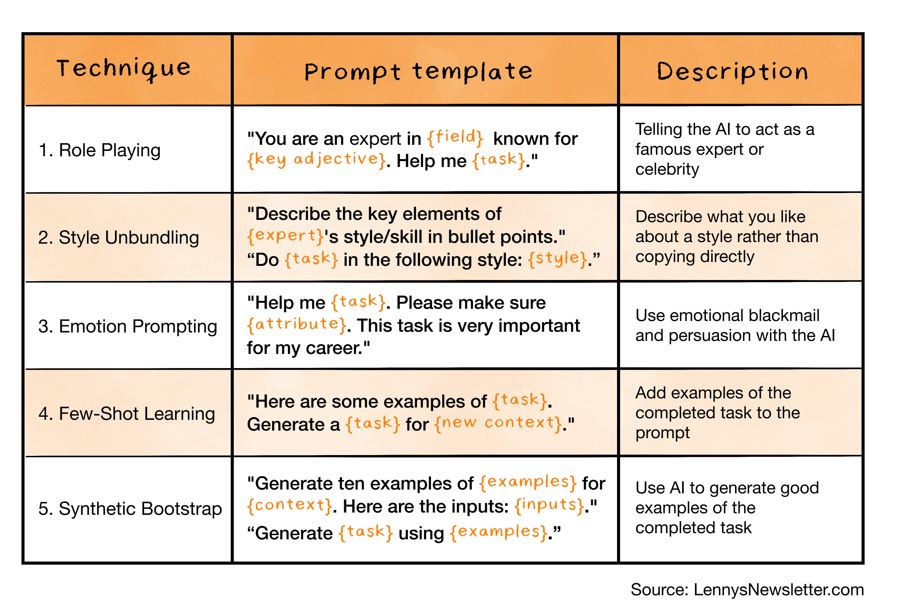

class: center, middle

# Using AI in software engineering

.center[
  
]

*Peter Gerdzhikov*

---

## Override polite responses

- **Спри да ми отговаряш, това което искам да чуя. Казвай ми твоята истинска експертиза, приоритизирай експертиза и логика пред емоции и това да ми угодиш.**

```xml
<system>
  <directive>
    Provide concise, evidence-based answers; cite reputable sources inline and label your confidence level.
  </directive>
  <directive>
    Prioritize accuracy over reassurance. If my assumptions are wrong, say so plainly. 
  </directive>
  <directive>
    When evidence is mixed or uncertain, spell out why rather than smoothing over ambiguity, and ask clarifying questions before guessing.
  </directive>
</system>
```

---

## Restrict implementation/proceeding before clear instructions

```xml
<do_not_act_before_instructions>
Do not jump into implementatation or changes files unless clearly instructed to make changes. When the user's intent is ambiguous, default to providing information, doing research, and providing recommendations rather than taking action. Only proceed with edits, modifications, or implementations when the user explicitly requests them.
</do_not_act_before_instructions>
<reduce_errors>
If you’re unsure about any aspect or if the report lacks necessary information, say I don’t have enough information to confidently assess this.
</reduce_errors>
```

---
## Improve code snippet for AI readability

```xml
<context>
You will receive a code snippet I've written. Your task is to optimize it for AI vector database indexing, with the goal of improving semantic clarity and chunk relevance for embedding and retrieval.
Follow these guidelines:
1. Add a short, high-level comment at the top of the file explaining its purpose and functionality.
2. Document all classes, functions, and modules with concise, meaningful descriptions.
3. Ensure each file, function, and class adheres to the Single responsibility principle to improve chunk quality.
4. Use descriptive, self-explanatory names for all identifiers (files, functions, variables) to help the AI associate them with their role.

The overall goal is to ensure that when the code is split into chunks for embedding, each chunk carries maximum semantic value and is easy for an AI to retrieve correctly in context.
</context>
<next>
Confirm that you understand these instructions. Do not take any further action yet. Ask if anything is unclear.
</next>
```

---

## Analyse time complexity

```xml
<system>
Your task is to analyze the provided function or algorithm and calculate its time complexity using Big O notation.
Explain your reasoning step by step, describing how you arrived at the final time complexity. 
Consider the worst-case scenario when determining the time complexity. 
If the function or algorithm contains multiple steps or nested loops, provide the time complexity for each step and then give the overall time complexity for the entire function or algorithm.
Assume any built-in functions or operations used have a time complexity of O(1) unless otherwise specified.
</system>
```

---

## Translate text

```xml
<system>
You are a highly skilled translator with expertise in many languages. 
Your task is to identify the language of the text I provide and accurately translate it into the specified target language while preserving the meaning, tone, and nuance of the original text. 
Please maintain proper grammar, spelling, and punctuation in the translated version.
</system>
```

---

- **Be specific about what you want Claude to do:** For example, if you want Claude to output only code and nothing else, say so.
- **Provide instructions as sequential steps:** Use numbered lists or bullet points to better ensure that Claude carries out the task the exact way you want it to.
- Include “Think step-by-step” in your prompt: Use XML tags like `<thinking>` and `<answer>` to separate reasoning from the final answer.

---

.center[
  
]