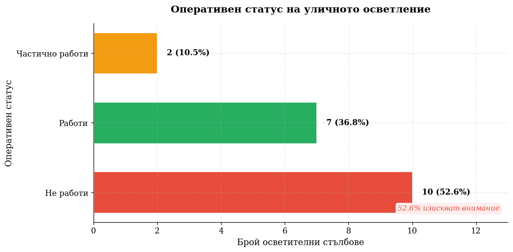

class: center, middle

# Мобилни ГИС

.center[
  
]

---
## 1. Какво е Mobile GIS?
* **Дефиниция:** Комбинация от софтуер, хардуер и GPS технология за работа с пространствени данни директно на терен.
* **Основна цел:** Пренасяне на мощта на настолните ГИС системи в мобилното устройство (смартфон или таблет).

.center[
  
]

---
## 3. Подготовка на данните (ArcGIS Online)
* **Създаване на слоеве (Layers):** Дефиниране на векторни слоеве (точки, линии, полигони) според нуждите на проекта.
* **Структуриране на атрибути:** Добавяне на специфични колони в атрибутивната таблица за прецизно събиране на метаданни.
* **Домейни и списъци:** Настройване на падащи менюта за по-бързо и безгрешно въвеждане на информация на терен.

---
## 4. Конфигуриране на Web Map
* **Интеграция:** Обединяване на всички подготвени слоеве в обща уеб карта.
* **Стилове и симвология:** Настройване на визуалното представяне на обектите за по-добра четивност.
* **Офлайн настройки:** Подготовка на картата за работа в зони без достъп до интернет.

---
## 5. Работа на терен (Field Collection)
* **Мобилен достъп:** Използване на ArcGIS Field Maps за достъп до уеб картата през смартфон или таблет.
* **Заснемане в реално време:** Геопозициониране и попълване на атрибутните данни за всеки обект директно на място.
* **Мултимедия:** Прикачване на снимки и документи към събраните геоданни.

---
## 6. Визуализация: ArcGIS Experience Builder
* **Интерактивен дизайн:** Превръщане на събраните данни в професионално уеб приложение.
* **Функционалност:** Добавяне на уиджети за търсене, филтриране и анализ на резултатите.
* **Достъпност:** Възможност за споделяне на крайния резултат с крайни потребители или вземащи решения лица.

---
## 7. Предимства на използвания работен процес
* **Единен източник на истина:** Данните се обновяват централизирано в ArcGIS Online.
* **Автоматизация:** Пътят от терена до уеб приложението е максимално съкратен.
* **User Experience:** Experience Builder позволява персонализиране на интерфейса спрямо нуждите на потребителя.то

---

.center[
  
]

```python
hole_sizes_data = { "Малка": 5, "Средна": 5, "Голяма": 3 }

hole_types = [key for key in hole_sizes_data.keys()]
hole_values = np.array([val for val in hole_sizes_data.values()])
total_holes = hole_values.sum()

fig, ax = plt.subplots(figsize=(8, 5))
colors = [COLORS['success'], COLORS['warning'], COLORS['danger']]
bars = ax.bar(hole_types, hole_values, color=colors, edgecolor='white', linewidth=1.5)

plt.show()
```

---

.center[
  
]

```python
danger_levels_data = { "Много ниско": 5, "Ниско": 3, "Средно": 3, ... }

danger_types = [key for key in danger_levels_data.keys()]
danger_values = np.array([val for val in danger_levels_data.values()])
total_danger = danger_values.sum()
danger_colors = ['#27AE60', '#2ECC71', '#F1C40F', '#E67E22', '#E74C3C']

fig, ax = plt.subplots(figsize=(10, 5))
bars = ax.bar(danger_types, danger_values, color=danger_colors, edgecolor='white', linewidth=1.5)

plt.show()
```

---

.center[
  
]

```python
road_types_data = { "Главен път": 14, "Второстепенен път": 0, ... }

road_names = [key for key in road_types_data.keys()]
road_values = np.array([val for val in road_types_data.values()])
total_roads = road_values.sum()

fig, ax = plt.subplots(figsize=(10, 5))
colors = [COLORS['accent'] if v > 0 else COLORS['light'] for v in road_values]
bars = ax.barh(road_names, road_values, color=colors, edgecolor='white', linewidth=1.5, height=0.6)

plt.show()
```

---

.center[
  
]

```python
lightpole_working_statuses_data = { "Не работи": 10, "Работи": 7, ... }

lightpole_statuses = [key for key in lightpole_working_statuses_data.keys()]
lightpole_values = np.array([val for val in lightpole_working_statuses_data.values()])
total_poles = lightpole_values.sum()

status_colors = [COLORS['danger'], COLORS['success'], COLORS['warning']]

fig, ax = plt.subplots(figsize=(10, 5))
bars = ax.barh(lightpole_statuses, lightpole_values, color=status_colors, edgecolor='white', linewidth=1.5, height=0.6)

plt.show()
```

---

.center[
  
]

```python
pole_conditions_data = { "Добро": 16, "Средно": 2, "Лошо": 0 }

pole_condition_types = list(pole_conditions_data.keys())
pole_condition_values = np.array(list(pole_conditions_data.values()))
total_condition = pole_condition_values.sum()

condition_colors = [COLORS['success'], COLORS['warning'], COLORS['danger']]

fig, ax = plt.subplots(figsize=(8, 5))
bars = ax.bar(pole_condition_types, pole_condition_values, color=condition_colors, edgecolor='white', linewidth=1.5)

plt.show()
```
