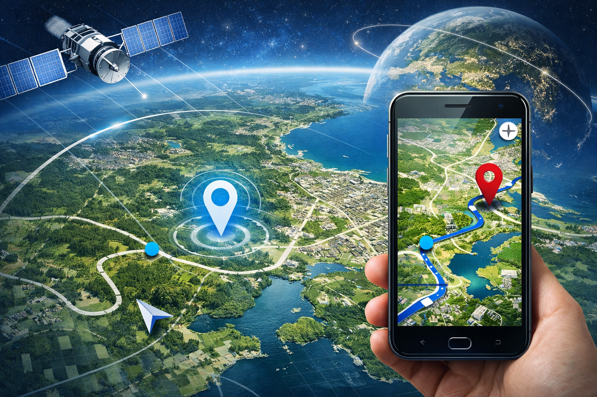
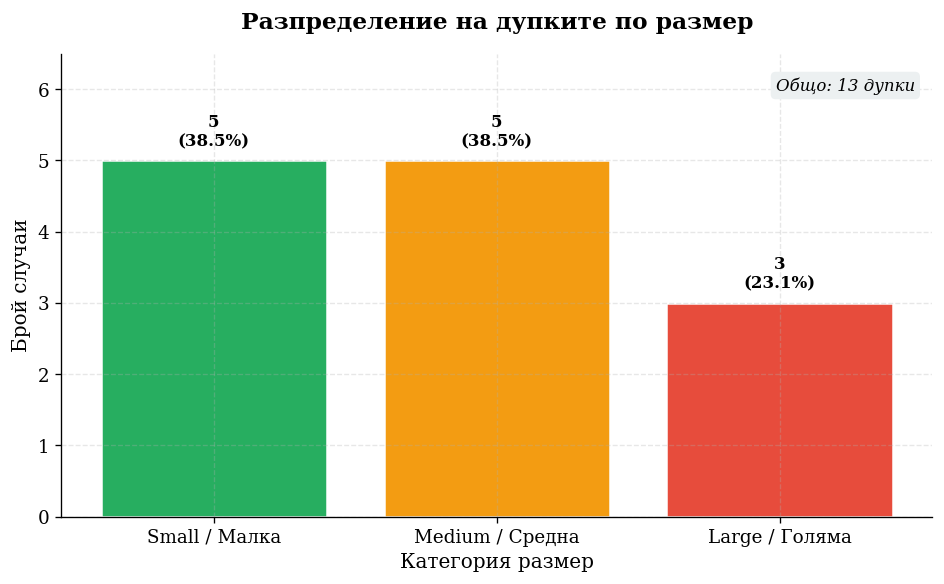
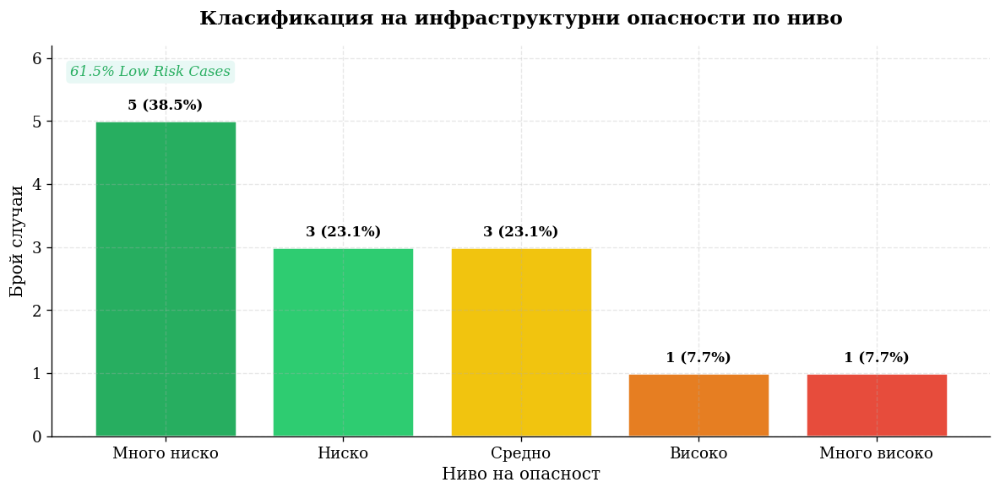
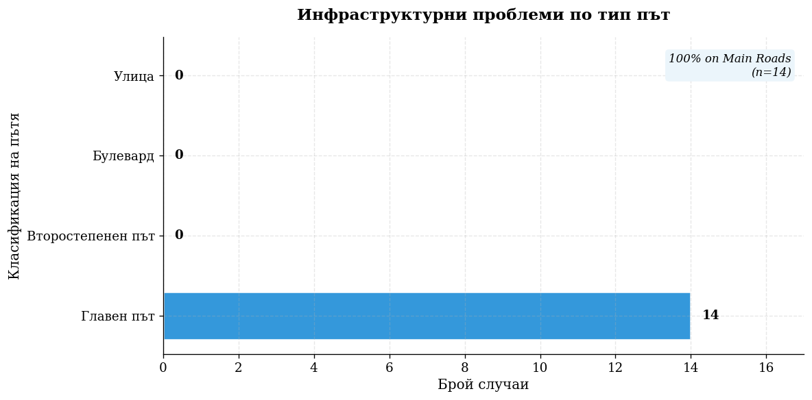
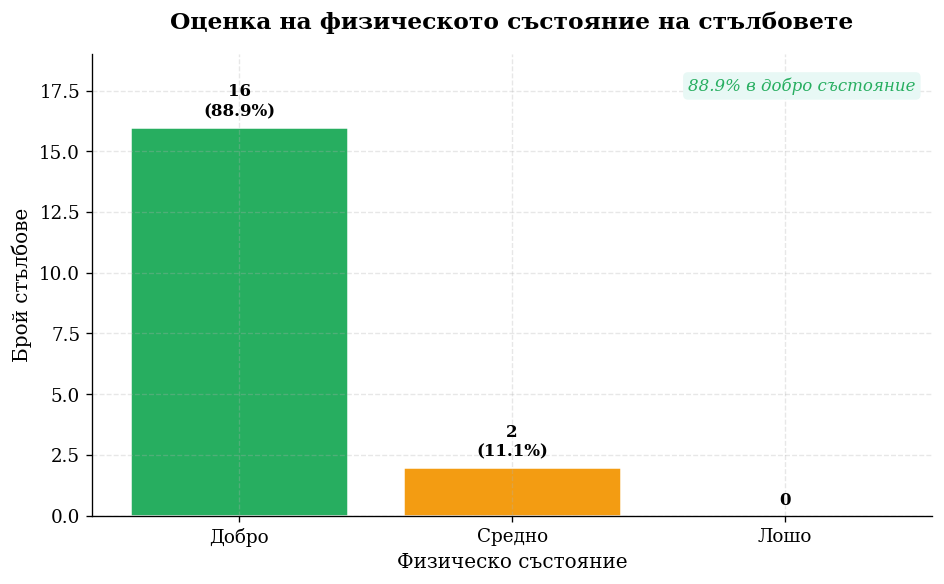

class: center, middle

# Мобилни ГИС

.center[
  
   ***GPT-5.2 Instant***
]

---
## Какво е Mobile GIS?
* **Дефиниция:** Комбинация от софтуер, хардуер и GPS технология за работа с пространствени данни директно на терен.
* **Основна цел:** Пренасяне на мощта на настолните ГИС системи в мобилното устройство (смартфон или таблет).

.center[
  
   ***Perplexity AI***
]

---
## 1. Подготовка на данните (ArcGIS Online)
* **Създаване на слоеве (Layers):** Дефиниране на векторни слоеве (точки, линии, полигони) според нуждите на проекта.
* **Структуриране на атрибути:** Добавяне на специфични колони в атрибутивната таблица за събиране (и бъдещо попълване) на метаданни.
* **Домейни и списъци:** Настройване на падащи менюта за по-бързо въвеждане на информация на терен.

---
## 2. Конфигуриране на Web Map
* **Интеграция:** Обединяване на всички подготвени слоеве в обща уеб карта.
* **Стилове и симвология:** Настройване на визуалното представяне на обектите за по-добра четивност.
* **Офлайн настройки:** Подготовка на картата за работа в зони без достъп до интернет.

---
## 3. Работа на терен (Field Collection)
* **Мобилен достъп:** Използване на ArcGIS Field Maps за достъп до уеб картата през смартфон или таблет.
* **Заснемане в реално време:** Геопозициониране и попълване на атрибутните данни за всеки обект директно на място.
* **Мултимедия:** Прикачване на снимки и документи към събраните геоданни.

---
## 4. Визуализация: ArcGIS Experience Builder
* **Интерактивен дизайн:** Превръщане на събраните данни в уеб приложение, скалируемо за десктоп и мобилни устройства.
* **Функционалност:** Добавяне на уиджети за търсене, филтриране и анализ на резултатите.
* **Достъпност:** Възможност за споделяне на крайния резултат с крайни потребители или вземащи решения лица.

---
## Предимства на използвания работен процес
* **Единен източник на истина:**  (Single source of truth) Данните се обновяват централизирано в ArcGIS Online.
* **Автоматизация:** Пътят от терена до уеб приложението е максимално съкратен.
* **User Experience:** Experience Builder позволява персонализиране на интерфейса спрямо нуждите на потребителя.

---

.center[
  
]

```python
hole_sizes_gathered_data = { "Малка": 5, "Средна": 5, "Голяма": 3 }

hole_type_names = [key for key in hole_sizes_gathered_data.keys()]
hole_values = np.array([value for value in hole_sizes_gathered_data.values()])
total_holes = hole_sizes_gathered_data.sum()

fig, ax = plt.subplots(figsize=(8, 5))
colors = [COLORS['success'], COLORS['warning'], COLORS['danger']]
bars = ax.bar(hole_type_names, hole_values, color=colors)

plt.show()
```

---

.center[
  
]

```python
danger_levels_gathered_data = { "Много ниско": 5, "Ниско": 3, "Средно": 3, ... }

danger_type_names = [key for key in danger_levels_gathered_data.keys()]
danger_values = np.array([value for value in danger_levels_gathered_data.values()])
total_danger = danger_values.sum()
danger_colors = ['#27AE60', '#2ECC71', '#F1C40F', '#E67E22', '#E74C3C']

fig, ax = plt.subplots(figsize=(10, 5))
bars = ax.bar(danger_type_names, danger_values, color=danger_colors)

plt.show()
```

---

.center[
  
]

```python
road_types_gathered_data = { "Главен път": 14, "Второстепенен път": 0, ... }

road_names = [key for key in road_types_gathered_data.keys()]
road_values = np.array([value for value in road_types_gathered_data.values()])
total_roads = road_values.sum()

fig, ax = plt.subplots(figsize=(10, 5))
colors = [COLORS['accent'] if v > 0 else COLORS['light'] for v in road_values]
bars = ax.barh(road_names, road_values, color=colors, edgecolor='white')

plt.show()
```

---

.center[
  
]

```python
lightpole_working_statuses_gathered_data = { "Не работи": 10, "Работи": 7, ... }

lp_status_names = [k for k in lightpole_working_statuses_gathered_data.keys()]
lp_values = np.array([v for v in lightpole_working_statuses_gathered_data.values()])
total_poles = lightpole_values.sum()

status_colors = [COLORS['danger'], COLORS['success'], COLORS['warning']]

fig, ax = plt.subplots(figsize=(10, 5))
bars = ax.barh(lp_status_names, lp_values, color=status_colors)

plt.show()
```

---

.center[
  
]

```python
pole_conditions_gathered_data = { "Добро": 16, "Средно": 2, "Лошо": 0 }

pole_condition_type_names = list(pole_conditions_gathered_data.keys())
pole_condition_values = np.array(list(pole_conditions_gathered_data.values()))
total_conditions = pole_condition_values.sum()

condition_colors = [COLORS['success'], COLORS['warning'], COLORS['danger']]

fig, ax = plt.subplots(figsize=(8, 5))
bars = ax.bar(pole_condition_type_names, pole_condition_values, color=condition_colors, edgecolor='white', linewidth=1.5)

plt.show()
```

---
# Изготвени материали

-  [Уеб карта (приложение)](https://arcg.is/0G5q9D1)
- [Jupiter notebook](https://github.com/PowerCell46/GithubPages/blob/main/Obsidian/MobileGis/MobileGisNotebook.ipynb)

.center[
  
   ***Seedream 4.5 AI****
]
