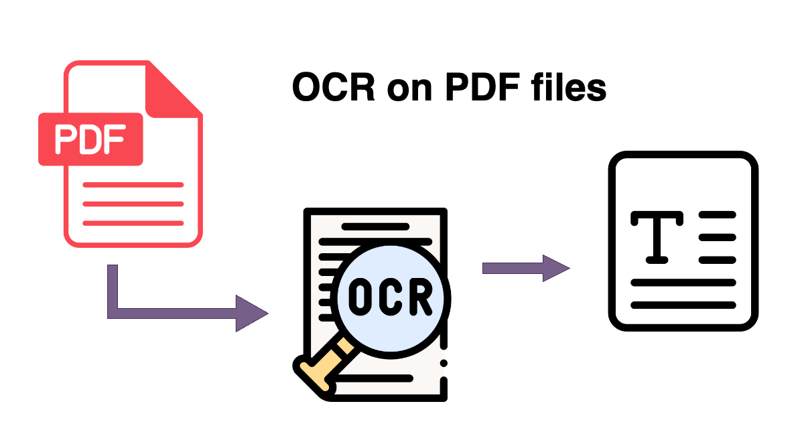
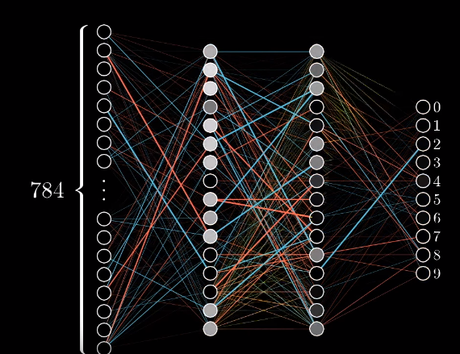
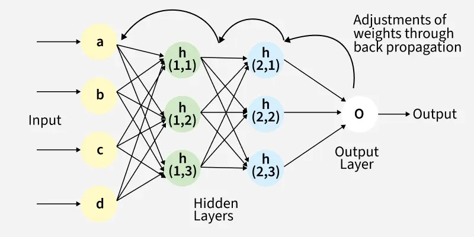
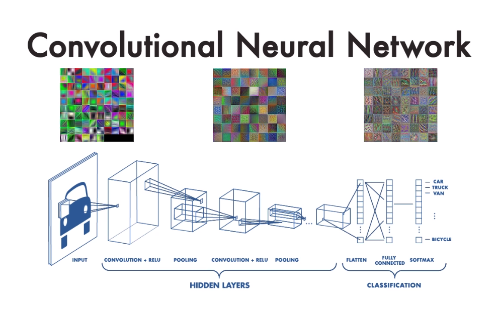

class: center, middle

# Artificial neural networks

.center[
  
]
 
**Автор:** Петър Герджиков – *Mid-level Software Engineer*

---

# Programming VS Machine & Deep learning

#### Традиционно програмиране:
- Developer пише логика
- Детерминистично – същи входове = същи изходи
- Скалируемост: добра за определени сценарии, лоша при сложност

#### Machine Learning / Deep Learning:
- Модел **учи** от примери в данните
- Data-driven подход – правилата се създават автоматично
- Скалируемост: висока за повторяващи се задачи с големи дейтасети

---

### Use case-ове на изкуствен интелект от работното място

OCR - Optical character recognition
- Разпознаване на ключови думи от фактури (контрагент, ЕГН, ЕИК, др.)

NLP - Natural language processor
- Извличане на ключови думи от имейл-сделка

LLM models, AI agents, etc.
- автоматизиране на задачи; консултация за подход при работа по даден тикет/задача; autocomplete

.center[
  
]

---

# ИНМ в Геопространствения анализ

#### Предизвикателства в традиционния ГИС анализ:
- Класификация на сателитни изображения отнема часове ръчна работа
- Извличане на геопространствена информация от растери е деликатно и субективно
- Необходимост за различни подходи при различни мащаби и типове данни

#### Как ИНМ решават тези проблеми:
- **Автоматизация:** обучен модел класифицира за няколко минути, вместо часове
- **Обобщение:** един модел може да работи на различни мащаби
- **Точност:** често по-добра от традиционните методи при достатъчно данни

---

## Разпознаване на къщи по сателитно изображение

.center[
  
]

---

# Какво е невронна мрежа?

#### Основната идея
- Събираме **голям брой елементарни компоненти** (неврони)
- Всеки неврон получава входове, прилага претегляне и активация
- Когато комбинираме хиляди такива елементи, можем да научим <b>много сложни</b> зависимости между входове и изходи

#### Биологична аналогия
- Биологичен неврон получава сигнали (дендрити), обработва ги и изпраща нов сигнал 
- Изкуствен неврон работи по подобен начин, но с числа вместо електрохимични импулси

---

# Artificial Neural Network

.center[
  
]

---

# Основни елементи на невронната мрежа

#### Основни компоненти:
- **Входове (x₁, x₂, ...):** Данни от външния свят (например пиксели от изображение, текст)
- **Тегла (w₁, w₂, ...):** Параметри, които показват "колко важен" е всеки вход. Това е което моделът **учи**.
- **Bias (b):** Допълнителен параметър, който позволява гъвкаво изместване на решаващата граница.
- **Активационна функция f():** Прилага се след претегления сбор – позволява нелинейност.

#### Активационни функции:
- **Sigmoid:** всички стойности между 0 и 1; проблем: малки градиенти при дълбоки мрежи
- **ReLU (Rectified Linear Unit):** Съвременен стандарт; максимум(0, x); бърза за обучение, стабилна

---

# Weights and Biases

.center[
  
]

---

# Обучение

- **Loss функция:** Измерва "колко лошо" предсказва моделът (сравнява предсказаното с реалното)
- **Gradient descent:** Алгоритъм, който намалява loss функцията чрез коригиране на теглата в правилната посока
- **Backpropagation:** Алгоритъм, който разпределя грешката назад през мрежата, за да се знае как да се променят теглата.

.center[
  
]

---

# CNN за геопространствени данни

#### CNN (Convolutional Neural Networks)
- Вместо напълно свързани слоеве, използваме **конволюционни слоеве**
- Използваме малки матрици (kernels), които се движат по изображението
- Улавя **локални пространствени структури** много по-ефективно
- Намалява брой параметри: по-бързо обучение, по-добра генерализация

#### Защо CNN са перфектни за ГИС?
- Растерни данни (сателитни, аерофото) са двумерни структури
- CNN естествено работи с локални зависимости в растерите
- Много по-ефективни от feedforward за растерни данни

---

.center[
  
]

---

# Приложение на CNN в ГИС

#### Защо CNN е подходящ за геопространствени данни?
- Растерни формати (GeoTIFF, COG) са природно двумерни матрици
- Локални признаци (текстури, ръбове) са критични за класификация земно покритие
- Модели обучени на един регион могат да работят на други региони

#### Ключови концепции:
- **Локални рецептивни полета:** Всеки неврон „вижда" само малък прозорец от изображението (например 3×3 пиксела)
- **Translation invariance:** Обект (сграда) се разпознава еднакво независимо от позицията
- **Йерархия на признаците:** Ранни слоеве → ръбове, средни → текстури, дълбоки → цели обекти

---

# CNN в практиката: примери

#### Практическо приложение:
- Класификация на сателитни 32×32 px patches в категории:
  - Град | Гора | Воден обект | Селскостопанска земя
- Всеки patch преминава през CNN и получава клас
	
#### Защо това работи?
- При обработка на сателитни сцени обектите са случайно разположени
- CNN обработва всяка локация еднакво (translation invariance)
- Улавя локални текстури и контрасти (граница град/поле, мрежа от дървета)

---

# Приложения в ГИС

#### Анализ на достъпност и обслужване
- Оценка на достъпността до услуги и обекти (болници, училища, транспортни възли) спрямо пътна мрежа и време за пътуване
- Входни данни: пътна мрежа (OpenStreetMap), DEM, административни граници, POI
- Приложение: пространствено планиране, оптимизация на обществени услуги, регионално развитие

#### Мониторинг на промени във времето
- Обезлесяване: сравнение на LULC карти за различни периоди
- Урбанизация: наблюдение на разширяването на град
- Промени в крайбрежни зони: ерозия, промени на линията брег
- Метод: обучение на модел и последователно прилагане на временни серии от Sentinel

---

# [Практическа част](https://github.com/PowerCell46/GithubPages/blob/main/Obsidian/SpatialAnalysisAndModeling/SatelliteImageClassification.ipynb)

#### Данни и начин на работа:
- **Дейтасет:** `eurosat\rgb`
- **Метод:** обучаване на модел за класификация

#### Tech stack:
- **TensorFlow / Keras:** Framework за deep learning
- **Python библиотеки:**
	- scikit-learn | pandas | numpy | matplotlib | rasterio | hugging-face

---

## Ще ни вземе ли AI професиите?

.center[
  
]
