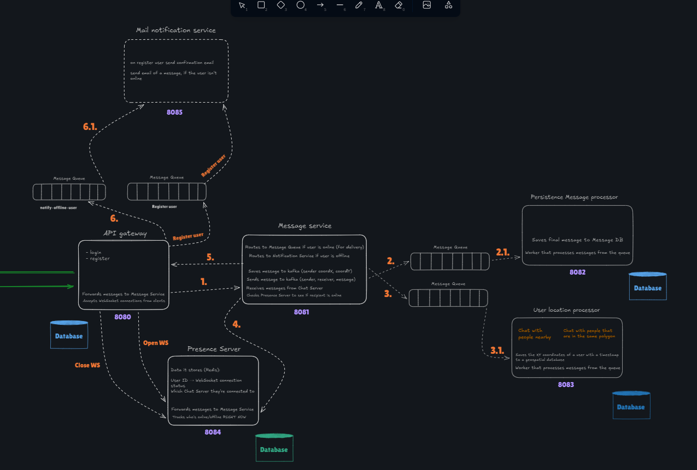
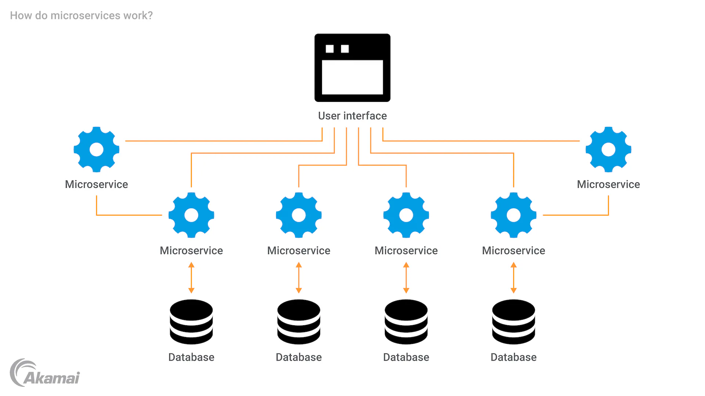
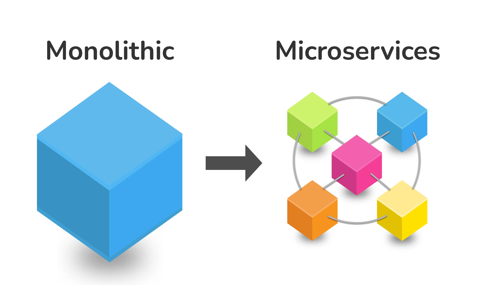
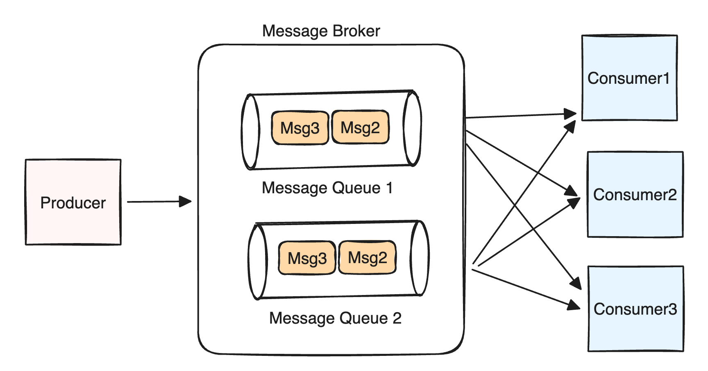
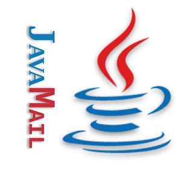

class: center, middle

# Twitter application

.center[
  
]

*Peter Gerdzhikov*

---

# Backend project architecture

.center[
  
]

---

# Project repositories

1. [Api Gateway](https://github.com/PowerCell46/ItCareerElevatorFifthExerciseApiGateway)
2. [Message Service](https://github.com/PowerCell46/ItCareerElevatorFifthExerciseMessagingMicroservice)
3. [Persist message Service](https://github.com/PowerCell46/ItCareerElevatorFifthExerciseMessagePersistenceMicroservice)
4. [User location Service](https://github.com/PowerCell46/ItCareerElevatorFifthExerciseUserLocationMicroservice)
5. [Presence Service](https://github.com/PowerCell46/ItCareerElevatorFifthExercisePresenceMicroservice)
6. [Mail Service](https://github.com/PowerCell46/ItCareerElevatorFifthExerciseMailMicroservice)

---

# What is а microservice?

A microservice is an architectural style where an application is built as a collection of small, independent services. Each service is responsible for a specific business capability and communicates with others via well-defined APIs. This approach improves scalability, fault isolation, and independent deployment.

.center[
  
]

---

# Microservice VS Monolith

A monolithic application packages all functionality into a single deployable unit, making it simple to start but hard to scale and maintain over time. In contrast, microservices separate concerns into independent services, enabling better scalability and team autonomy. The trade-off is increased operational and architectural complexity.

.center[
  
]

---

# What is Spring?

Spring is a comprehensive Java framework used to build robust, scalable backend applications. It provides dependency injection, security, data access, and REST API support out of the box. Spring Boot further simplifies configuration and accelerates development.

.center[
  
]

---

# What is a message broker?

Kafka is a distributed message broker designed for high-throughput, fault-tolerant data streaming. It enables asynchronous communication between microservices, reducing tight coupling. This makes the system more resilient and scalable under load.

.center[
  
]

---

# Postgre & Postgis

PostgreSQL is a powerful open-source relational database, while PostGIS extends it with spatial and geospatial capabilities. Together, they allow efficient storage, querying, and analysis of geographic data. The listed libraries enable seamless integration with Java and Hibernate.
- postgis-jdbc
- hibernate-spatial
- jts-core

---

# Mail sender

Spring Boot Mail provides built-in support for sending emails using Java Mail Sender. It is commonly used for notifications such as account verification, password reset, and system alerts. Configuration is minimal and integrates cleanly with the Spring ecosystem.

.center[
  
]